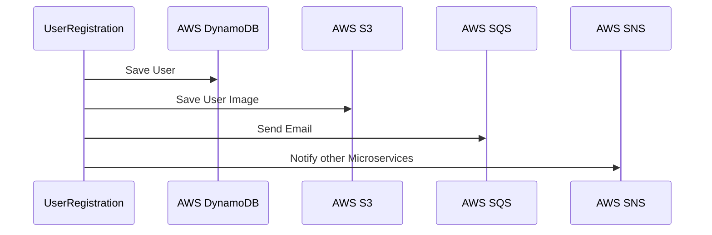

# Why Localstack

Hi! I'm your first Markdown file in **StackEdit**. If you want to learn about StackEdit, you can read me. If you want to play with Markdown, you can edit me. Once you have finished with me, you can create new files by opening the **file explorer** on the left corner of the navigation bar.

# How to setup

StackEdit stores your files in your browser, which means all your files are automatically saved locally and are accessible **offline!**

# Example

You can see here the sequence diagram of our user registration API. As input to the API, the user will provide his/her information in the form of first name, last name, email and mobile and also upload a profile picture. Our API will save the record in DynamoDB, the profile pic in S3, send an email by putting a message in a SQS queue and publish a "User Created" message to a SNS topic to notify interested consumer microservices.

## Create your microservice with Spring Boot
I started by creating a Spring boot rest api using start.spring.io with minimum dependencies for web, and lombok.
I added the AWS SDK dependencies for S3,DynamoDB, SQS and SNS to the pom.xml of the application generated in previous step.
I created the controller class containing the endpoint and a service class for invoking the AWS services.
Finally I created 2 test classes 1 for testing my endpoint and other for the service class. I used 2 profiles- local - for testing using Localstack and integration for testing with AWS services.

## Run using Localstack

Edit docker compose yaml to enable services for SQS,SNS,S3 and DynamoDB
Start Localstack .
Run junit

## Run using AWS

Create AWS resources using cloudformation. I prefer this approach instead of creating the resources individually from console since I can tear up and recreate the resources. It allows me to clean up all resources with a single command at the end of the exercise.
// TODO cloudformation yaml link

This is the step you save in the beginning during development or someone else can work on this while you are writing your code.

Set up your default profile. Advice repeated ad-nauseum - Do not hard code credentials in code. I have used the credentialchain which checks available credentials in sequence. To make it more secure you can use STS.

Finally we run our spring boot app connected to AWS by switching to integration profile.

## Clean up

You can delete the current file by clicking the **Remove** button in the file explorer. The file will be moved into the **Trash** folder and automatically deleted after 7 days of inactivity.

# Conclusion

We saw how to use localstack for testing the integration of our application with AWS services locally. During initial days of development it helps to focus on writing code for the application instead of spending time on setting up the environment for AWS connectivity. It often gets tedious when you are working in a controlled environment where you need to request access from other teams. Localstack also has an enterprise version available with a more services. I hope this will help you to have more fun with working with AWS services in your local environment without bothering about AWS permissions and incurring cost.

<!--stackedit_data:
eyJoaXN0b3J5IjpbNDc2MzgxNTcxXX0=
-->